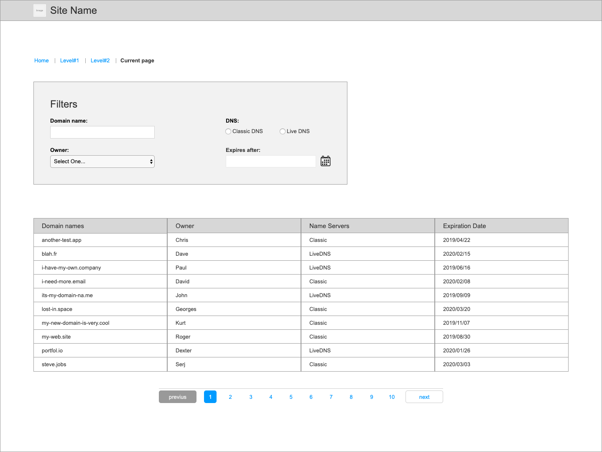

# react-coding-challenge

Implement a list of domain names with fields to filter **server side**.

<p align="center">
  
</p>

## Getting started

```
# Clone the repo
git clone git://github.com/Gandi/react-coding-challenge.git
cd react-coding-challenge

# Start mock server
cd server
npm install
npm start
```

## Functional requirements

* User must be able to see all his domain names.
* User must be able to filter on his domain names by:
	* searching for a giving fqdn pattern,
	* searching for a specific owner,
	* searching for classic or livedns nameservers,
	* searching for to be expired domains.

## Non-functional requirements

* The code should be hosted on GitHub and submitted as a pull request.
* Use high-quality existing libraries or small amounts of custom code.
* Show your work through your commit history.
* You can style the project as you like.
* Be proud of your work.

## Domains endpoint details
The endpoint has the following format

```
/api/domains?~fqdn={}&owner={}&nameservers={}&>expiration_date={}
```

Request querystring:

* `~fqdn` is the LIKE pattern for searching a domain name.
* `owner` is a specific owner of a domain name.
* `nameservers` is the value of current name servers and is an enum (classic | livedns).
* `>expiration_date` is the date after which you seek expiring domains.

Response payload:

```
Array<{
	fqdn: string;
	owner: string;
	nameservers: 'classic' | 'livedns';
	expiration_date: string;
}>
```

## Owners endpoint details
The endpoint has the following format

```
/api/owners
```

Response payload: `Array<string>`.